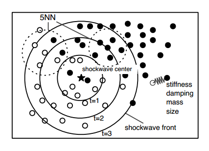

# Model Based Sonification
from "The Sonification Handbook": https://sonification.de/handbook/chapters/chapter16/#S16.4  

## intro

MBS - creation of processes that evolve in time to systematically sonify data  
--> data itself doesn't need to have timely dimension --> even better without, else parameter mapping or similar recommended  
--> excitation needed to start sounding: a dynamic sound that changes in time  

it's a lot about the nature of the data (structure and distribution)  

best analogy: like a box that one tries to guess the content of by shaking it: excitation, direct audible response, many possibilities of handling  
--> gradually build up a mental representation

**in short:**  
> Model-Based Sonification (MBS) is defined as the general term for all concrete sonification techniques that make use of dynamic models which mathematically describe the evolution of a system in time, parameterize and configure them during initialization with the available data and offer interaction/excitation modes to the user as the interface to actively query sonic responses which depend systematically upon the temporal evolution model.[1](#001)

> The data neither determine the sound signal (as in audification) nor features of the sound (as in parameter mapping sonification), but instead they determine __the architecture of a 'dynamic' model__ which in turn generates sound. [2](#002)

## which data?
- high-dimensional  
- non-timely  

## constructive conditions

in order to be able to get a representative mental picture of the data's nature, the following conditions should be provided:  
- ubiquity (every action should be accompanied by sound)
- invariance of binding mechanism (sound producing laws always the same and structurally independent of the dataset (e.g. for comparing different datasets))
- immediate response: real-time sound generation
- sonic variability: it should be possible to produce different sounds from different interaction
- information richness: sounds should be complex and rich  
--> "MBS offers a framework for the creation of sonification models which __automatically__ behave according to these requirements" [1](#001)

## example: data sonogram

  
[3](#003)

scatter plot of data  
--> excite a shock wave in data space  
--> wave front excites mass-spring systems: each point is mass-spring system that oscillates once it is hit by shock wave

provides information about data density and clustering   
parameters --> stiffness / damping of individual springs  

[sound examples 16.2a-c](https://sonification.de/handbook/chapters/chapter16/)

## step-by-step procedure

  
[2](#002)

1. setup
	bridges the gap between data-space (static) and model-space (dynamic)  
	--> what type of model?	e.g. decide to make a data sonogram  
2. dynamics
	introduction of temporal dynamics: mathematical description of motion or whatever is applied from mechanics, electrodynamics, chemistry, machine learning, ...  
3. excitation
	interaction interfaces?   
	mouse click, keystroke, shake; hitting surfaces at different locations, squeezing, shaking, rubbing, deforming; controllers with parameter-rich interfaces (**what kind of sensors could be applied?**)  
4. initial state
	load and initialize data, puts system into initial position  
5. link-variables
	variables responsible for the sound signal generation from within the models' dynamic processes    
	keep the arbitrariness at a minimum!  
	simplification needed for real-time application in higher dimensional datasets (e.g. precalculate average values before sending them to dac)  
6. listener characteristics
	single sound source vs sound scenery?    
	location, orientation or distance of the listener? mono vs stereo vs surround implementations?  

## examples
(we have seen the data sonogram)

they all base on scatter plots --> **other plots thinkable, too?**

### Tangible Data Scanning
data points located in 3D-space around the user  
moving a tracked planar object excites datapoints (as mass-spring system) when hit  

[sound example S16.3: Tangible Data Scanning Video](https://sonification.de/handbook/chapters/chapter16/)  

### Data Crystallization and Sonification
fixed "molecules" (data points)  
excitement: mouse click places crystallization seed  
"the eigenvalues determine the harmonic series while the overall variance determines the size and thereby the fundamental frequency of the sound" [4](#004)  
growth --> pitch drops, brightness signature modulates  

[sound example S16.5: Data Crystallization Sonification](https://sonification.de/handbook/chapters/chapter16/)

suitable for clustering of data and local dimensionality structure of clusters  

### Growing Neural Gas Sonification

data points as "neurons", each contributing to the overall sound:  
edges add up to overall restoring force --> higher frequency of that neuron oscillating around its position  
each neuron creates a sine wave, number of edges influencing the stiffness  

allowing perception of overall connectivity of the graph structure  
also reveals overfitting (shows where randomness of data is made audible instead of underlying relationship)  

[media file S16.9: video of a GNG growth for a 2d spiral data set](https://sonification.de/handbook/chapters/chapter16/)

## discussion:
what data suitable? any examples?  
what sensors suitable?  
what plot types interesting?

## literature
<a name="001">[1]</a> - Herrmann, T., Hunt, A., Neuhoff, J. G. (2011): The Sonification Handbook. 403. Berlin: Logos Publishing House.  
<a name="002">[2]</a> - ibid, 404.  
<a name="003">[3]</a> - ibid, 409.  
<a name="004">[4]</a> - ibid, 411.  
